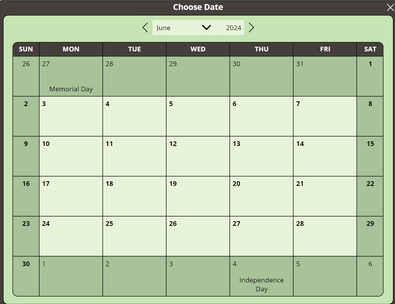

# 📅 Custom Calendar Date Picker Component for Power Apps

---

## Overview

This component is a flexible, customizable **calendar date picker** built in Power Apps using a single gallery and slider-based logic.  
It calculates dates based on the user's selection, handles workdays, custom holidays, and fires `OnSelect` and `OnClose` events to the parent app.

Fully self-contained, customizable, and ready for both Canvas Apps and Component Libraries.

---

## ✨ Key Features

- Workday-based date calculations
- Holiday observance (US holidays, auto-adjusted for weekends)
- Fully customizable theme (colors, corners, row height)
- Selectable title and initial date
- Firing of custom `OnSelect` and `OnClose` events
- HTMLText styling with color-to-hex conversion
- Auto-detection for IDE vs published mode
- Optional progress bar

---

## 🔧 Custom Functions

| Function | Description |
|:---------|:------------|
| `Workday(start, days)` | Returns the workday `days` away from `start` (negative for past). |
| `NetWorkdays(start, end)` | Calculates the number of workdays between two dates. |
| `AutomaticHolidays()` | Builds a table of major US holidays with observed weekdays (current ± 5 years). |
| `CalculateEaster(year?)` | Returns Easter Sunday for a given year (defaults to current year if none given). |
| `ColorToText(color)` | Converts a Power Apps color to a hex text string for HTML use. |

---

## 📥 Custom Properties (Inputs)

| Property | Purpose |
|:---------|:--------|
| `Theme` | Color and styling configuration (default: *Mint Chocolate Chip* theme). |
| `CalendarDate` | Default date shown when the calendar opens. |
| `CalendarTitle` | Title text displayed at the top of the calendar. |
| `CornerRadius` | Sets the roundness of the calendar corners. |
| `Data` | Weekday and month names for localization (defaults to standard Power Apps output). |
| `Holidays` | Override the holiday table (defaults to `AutomaticHolidays()` output). |
| `RowHeight` | Adjusts vertical spacing between calendar rows. |

---

## 📤 Custom Properties (Outputs)

| Property | Purpose |
|:---------|:--------|
| `OutputDate` | The date selected by the user. |
| `About` | Record showing version information about the component. |

---

## 🔥 Custom Events

| Event | When it Triggers |
|:------|:----------------|
| `OnSelect` | Fires when the user selects a date (use `OutputDate` to retrieve it). |
| `OnClose` | Fires when the 'X' is clicked **or** a date is selected, signaling closure. |

---

## 🚀 How It Works

- **Gallery-based Layout**: Days of the month are rendered through a slider-controlled gallery.
- **Date Calculation**: Clicking a day cell calculates the correct date, even across months.
- **Holiday Highlighting**: Holidays automatically adjust if they fall on weekends.
- **Theme and Styling**: Colors and fonts are controlled through the `Theme` object.
- **Live App Detection**: Adjusts gallery template height automatically when running in the published app vs. the IDE.
- **Progress Bar** *(Optional)*: Progress bar added for additional polish.

---

## 🛠 Known Updates/Fixes

- **Holiday Correction**: Fixed Christmas Eve and New Year's Eve weekday observance issue.
- **HTMLText Issue**: Adjusted the gallery sizing dynamically to fix the rendering glitch between editor mode and live app mode.
- **Progress Bar**: Added optional progress bar feature (can be hidden if not needed).
- **Early Work on Rich Text Editor**: Future expansion planned (ignore for now).

---

## 📚 How to Use

1. Import the `.msapp` component file into your app or component library.
2. Place the calendar on any screen or popup.
3. Set input properties (like `CalendarTitle`, `Theme`, `CalendarDate`) as needed.
4. Handle `OnSelect` and `OnClose` events to capture selected dates.
5. Optionally customize the holiday list or theme.

---

## 🙏 Credits

Built with love and nerdy attention to detail.  
Feel free to use, modify, improve, and share.

---

