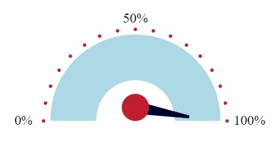

## 

---

# Power Apps - Gauge Chart Component

A simple, customizable **gauge chart** component for Power Apps.  
Easily visualize any value between 0 and 100 with a clean, minimal design.

---

## ✨ Features

- Display values between **0%** and **100%**
- Set custom labels for **left**, **middle**, and **right** gauge points
- Choose your own **fill color** for the chart
- Lightweight and ready for immediate use in any app

---

## ⚙️ Exposed Properties

| Property Name | Type | Description |
|:--------------|:-----|:------------|
| `LabelA` | Text (Input) | Label for the **left** side of the gauge |
| `LabelB` | Text (Input) | Label for the **middle** of the gauge |
| `LabelC` | Text (Input) | Label for the **right** side of the gauge |
| `Value` | Number (Input) | The value to display on the gauge (must be between `0` and `100`) |
| `FillColour` | Color (Input) | Color for the gauge fill |

---

## 🧠 How It Works

1. Set your `Value` between 0 and 100.
2. Choose your custom labels for `LabelA`, `LabelB`, and `LabelC`.
3. Pick a `FillColour` that matches your app’s theme.
4. The gauge dynamically adjusts and displays the corresponding fill.

---

## 📋 Example Setup

| Property | Example |
|:---------|:--------|
| LabelA | `"Low"` |
| LabelB | `"Target"` |
| LabelC | `"High"` |
| Value | `67` |
| FillColour | `RGBA(0, 120, 212, 1)` (VA blue) |

Result:  
A gauge showing 67%, with the labels "Low", "Target", and "High".

---

## 🚀 Quick Start

- Import the **GaugeChart** component into your app.
- Set the properties as needed.
- Drop it onto your screen and you're ready to go!

---

## 📌 Notes

- Make sure the `Value` you pass in is numeric and stays between 0 and 100.
- If you want different ranges (like 0-1000), you'll need to customize the scaling.

---

