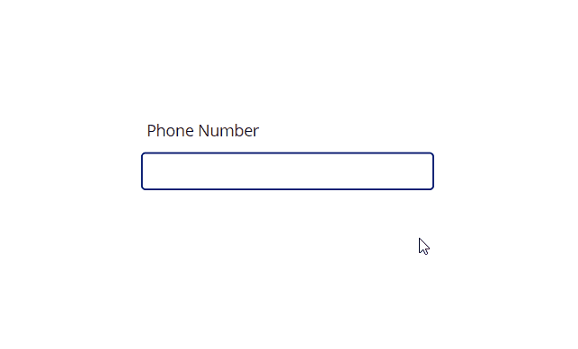

## 

---

# Power Apps - Phone Number Input Mask Component

This **Power Apps** component provides a smart text input box that automatically formats a phone number as the user types —  
keeping data entry clean, readable, and consistent.

---

## ✨ Features

- Automatically formats phone numbers during typing
- Only allows numeric input (no accidental characters)
- Works with **single** or **multiple** phone number formats
- Supports different country formats (Canada, US, UK, Japan, India, etc.)
- Easy to customize and deploy
- Provides both **formatted** and **raw** output

---

## ⚙️ Exposed Properties

| Property Name | Type | Description |
|:--------------|:-----|:------------|
| `InputMask` | Text (Input) | Defines a single phone number format. Example: `(###) ###-####` |
| `InputMaskMultipleFormats` | Table (Input) | Defines multiple formats based on prefixes (for countries like UK). `InputMask` must be blank to use this. |
| `PhoneNumber` | Text (Output) | The unformatted phone number (digits only). |
| `Text` | Text (Output) | The formatted phone number shown in the input box. |

---

## 📱 Example — Single Phone Number Format

| Country | Example | InputMask |
|:--------|:--------|:----------|
| Canada | `204-998-8344` | `"###-###-####"` |
| US | `(204) 998-8344` | `"(###) ###-####"` |
| United Kingdom | `+44 1234 567890` | `"+## #### ######"` |
| Japan | `(03)-4567-1234` | `"(##)-####-####"` |
| India | `+91 0123 456789` | `"+## ####-######"` |

---

## 📚 Example — Multiple Phone Number Formats (United Kingdom)

```powerfx
Table(
    { Prefix: "01", Format: "##### ######" },
    { Prefix: "02", Format: "### #### ####" },
    { Prefix: "03", Format: "#### ### ####" },
    { Prefix: "07", Format: "##### ######" },
    { Prefix: "08", Format: "#### ### ####" },
    { Prefix: "", Format: "##### ######" }
)
