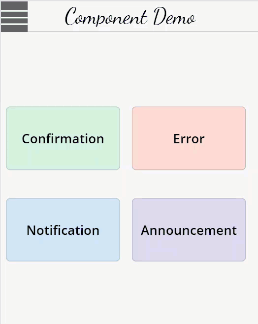

## 

---

# Power Apps Alert Component

A **Power Apps** reusable component that displays flexible alert banners for various message types like Confirmation, Error, Notification, and Announcement.  
You can control appearance, location, message, and behavior — all through simple exposed properties.

---

## 🚀 Features
- Display 4 types of alerts: **Confirmation**, **Error**, **Notification**, **Announcement**
- Control the **alert message**, **location** (top or bottom), and **theme colors**
- Set **duration** for how long the alert stays visible
- Fully customizable styles for different alert types

---

## ⚙️ Exposed Properties

| Property Name    | Type             | Description |
|:-----------------|:-----------------|:------------|
| `ShowAlert`       | Boolean (`true/false`) | Controls whether the alert should appear |
| `Type`            | Text              | Defines type of alert (`Confirmation`, `Error`, `Notification`, `Announcement`) |
| `Message`         | Text              | Custom text for the alert message |
| `AlertLocation`   | Text              | Position of the alert (`Top` or `Bottom` of the screen) |
| `FillColor`       | Color             | Background color for each alert type |
| `AlertDuration`   | Number (seconds)  | How long the alert should stay visible |

---

## 🛠️ How It Works

- **1)** Set `ShowAlert` to `true` when you want to show an alert.
- **2)** Choose your `Type` — Confirmation, Error, Notification, or Announcement.
- **3)** Customize the `Message` you want the user to see.
- **4)** Set the `AlertLocation` where it should pop up — `Top` or `Bottom`.
- **5)** Adjust the `FillColor` to match your app’s theme (optional).
- **6)** Set `AlertDuration` to control how long the alert stays visible before fading away.

When the alert is dismissed (either automatically after duration or manually), `ShowAlert` resets back to `false`.

---

## 🎯 Example Use

```powerfx
// Show a success message at the top for 5 seconds
Set(varShowAlert, true);
Set(varAlertType, "Confirmation");
Set(varAlertMessage, "Data saved successfully!");
Set(varAlertLocation, "Top");
Set(varAlertFillColor, RGBA(198, 239, 206, 1));
Set(varAlertDuration, 5);
