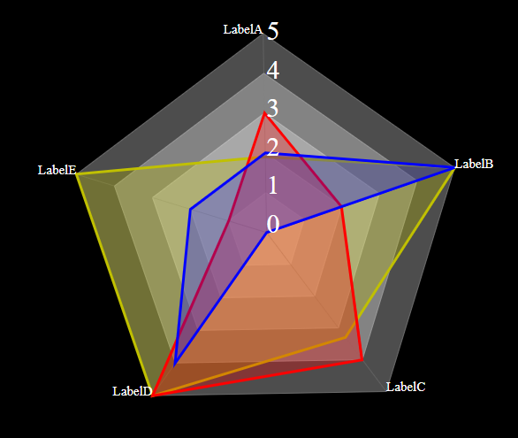
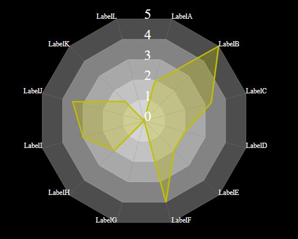

## 
## 

---

# Power Apps - Radar Chart Component

A flexible **SVG-based Radar Chart** (Spider Graph) component for Power Apps.  
Visualize multi-dimensional data in a clean, customizable radar plot with 12 vertices — or a pentagon for simplified comparisons.

---

## ✨ Features

- **12-point Radar Graph**: Supports 12 axes, each with custom labels and values.
- **Pentagon Radar Graph**: Optionally switch to a 5-point radar chart for comparing up to 3 sets of values.
- Customizable minimum and maximum values.
- Control the color of the shadow/fill zone.
- Fully dynamic and lightweight SVG generation — no external libraries needed.

---

## ⚙️ Exposed Properties

### Common Properties

| Property Name | Type | Description |
|:--------------|:-----|:------------|
| `minValue` | Number (Input) | Minimum value across all vertices |
| `maxValue` | Number (Input) | Maximum value across all vertices |
| `strokecolor` | Color (Input) | Color for the radar's filled/shadow area |

---

### 12-Vertex Specific Properties

| Property Name | Type | Description |
|:--------------|:-----|:------------|
| `LabelA` - `LabelL` | Text (Input) | Label text for each vertex (12 total) |
| `ValueA` - `ValueL` | Number (Input) | Value for each corresponding vertex (12 total) |

---

### Pentagon Specific Properties (Alternative Version)

- **Supports 3 sets of values**.
- Useful for comparing **multiple scenarios** on a 5-point star.

| Property | Type | Description |
|:---------|:-----|:------------|
| `Label1` - `Label5` | Text | Labels for the 5 points |
| `Set1Value1` - `Set1Value5` | Number | Values for Dataset 1 |
| `Set2Value1` - `Set2Value5` | Number | Values for Dataset 2 |
| `Set3Value1` - `Set3Value5` | Number | Values for Dataset 3 |

---

## 🧠 How It Works

- Each label and value defines a **vertex** on the radar.
- Values are automatically **normalized** between `minValue` and `maxValue`.
- The **filled zone** inside the radar reflects the relative size of the values.
- SVG graphics dynamically update whenever properties change.
- **StrokeColor** controls the appearance of the shaded data area.

---

## 📋 Example Setup (12-Vertex)

| Property | Example |
|:---------|:--------|
| LabelA | `"Agility"` |
| LabelB | `"Strength"` |
| LabelC | `"Endurance"` |
| ValueA | `70` |
| ValueB | `85` |
| ValueC | `60` |
| minValue | `0` |
| maxValue | `100` |
| strokecolor | `RGBA(0, 150, 136, 0.6)` (teal shadow) |

Result:  
A 12-sided radar chart showing a performance profile.

---

## 🚀 Quick Start

1. Import the `.msapp` file into your Power Apps project.
2. Place the **RadarChart** component on your screen.
3. Set label and value properties according to your data.
4. Adjust `minValue`, `maxValue`, and `strokecolor` for styling.
5. Preview your dynamic radar chart instantly!

---

## 📌 Notes

- **Values outside** `minValue`–`maxValue` will be clipped.
- **All labels and values must be populated** for a full radar graph.
- **SVG rendering** is lightweight and very fast inside Power Apps.

---

## 🙏 Credits

Component inspired by real-world business KPIs and competency frameworks.  
Built for flexible, beautiful multi-dimensional data visualization in Power Apps.

---

