## 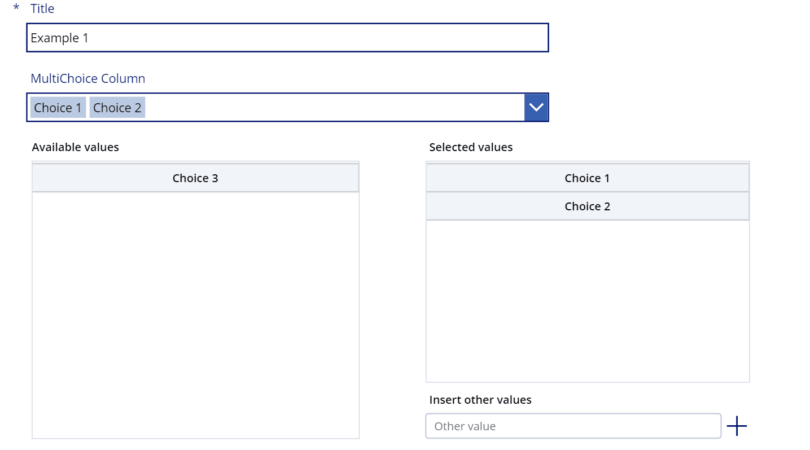

---

# Power Apps - MultiChoice Field with Fill-In Support for SharePoint Lists

Power Apps forms are an excellent tool to customize SharePoint list forms — but by default, MultiChoice fields are limited to ComboBoxes that **do not allow users to "Fill-In" custom choices**.

This component solves that problem by allowing users to select existing choices **and** type in new custom values — fully supporting the original SharePoint Fill-In Choice behavior inside Power Apps.

---

## 🖼 Problem Example

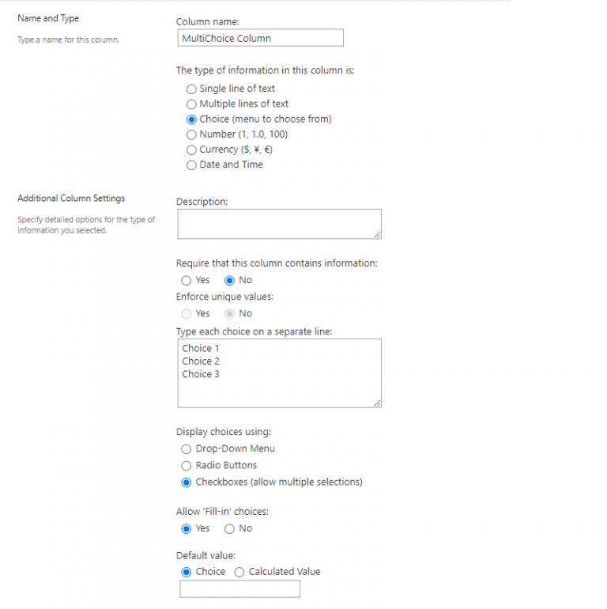

- Default behavior = no fill-in option allowed
- Users can only pick from predefined list items

---

## ✨ Features

- Support **MultiChoice fields with Fill-In options**
- Seamless SharePoint List integration
- Easy configuration with simple variables
- Full support for edit mode and view mode
- Resettable component behavior

---

## 📦 How To Set Up

### 1. Save Available Choices

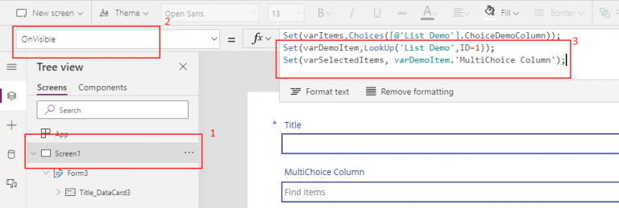

```powerfx
Set(varItems, DataCardValueXX.Items);
```

---

### 2. Save Selected Choices

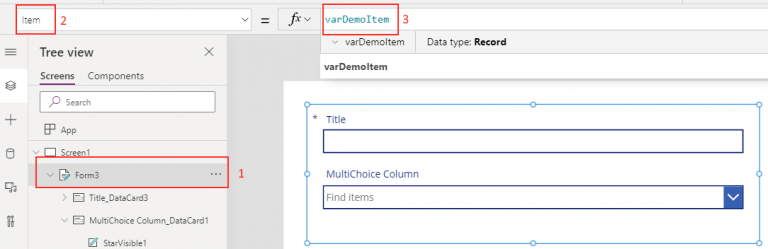

```powerfx
Set(varDemoItem, ThisItem);
Set(varSelectedItems, DataCardValueXX.SelectedItems);
```

---

### 3. Set Form Item

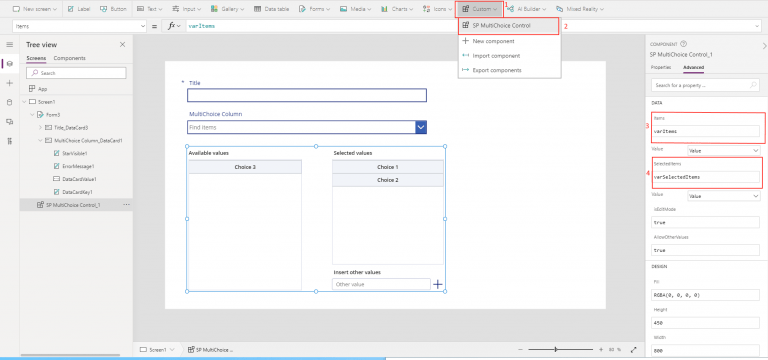

```powerfx
FormName.Item = varDemoItem
```

---

### 4. Add Component to the Screen

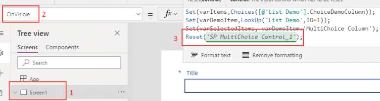

Set the `Items` and `SelectedItems` properties of the component to `varItems` and `varSelectedItems`.

---

### 5. Reset the Component

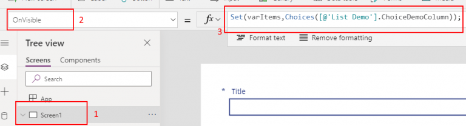

In your screen `OnVisible` property:

```powerfx
Reset(ComponentName)
```

---

### 6. Configure Default Selected Items

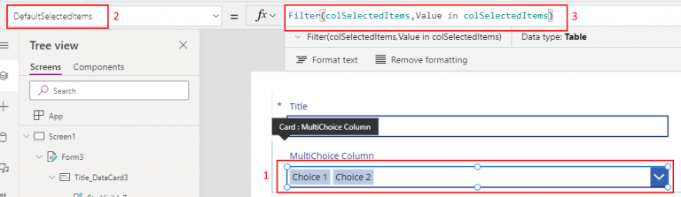

```powerfx
DefaultSelectedItems = Filter(varSelectedItems, Value in varSelectedItems)
```

---

### 7. Set Edit Mode

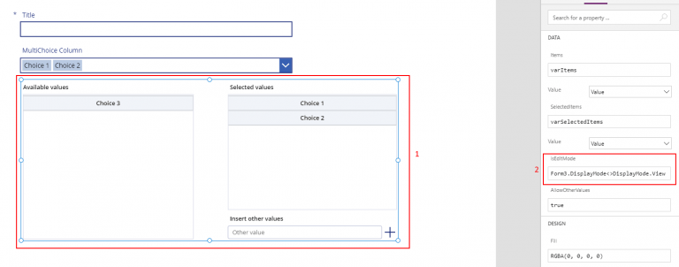

```powerfx
IsEditMode = true
```

---

### 8. Final Result

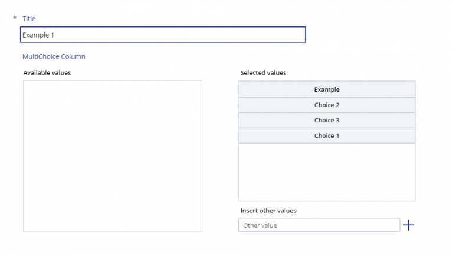

---

## 🖥️ Component Behavior in Action

**Type in new choices:**

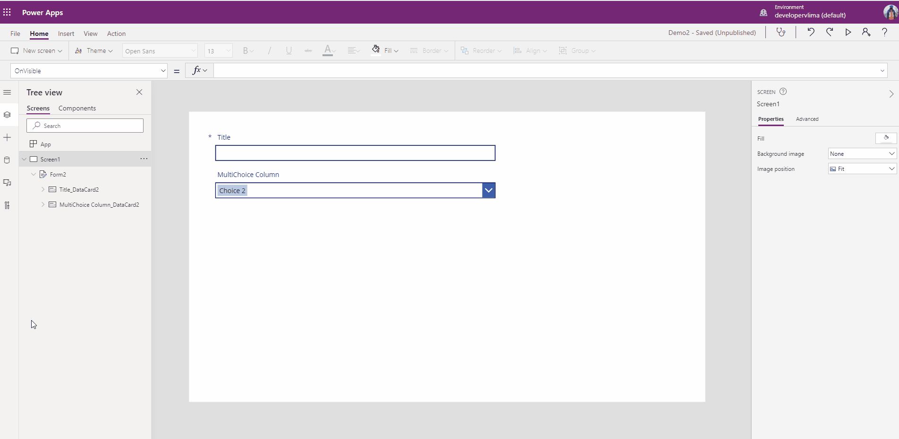

---

**Dropdown behavior:**

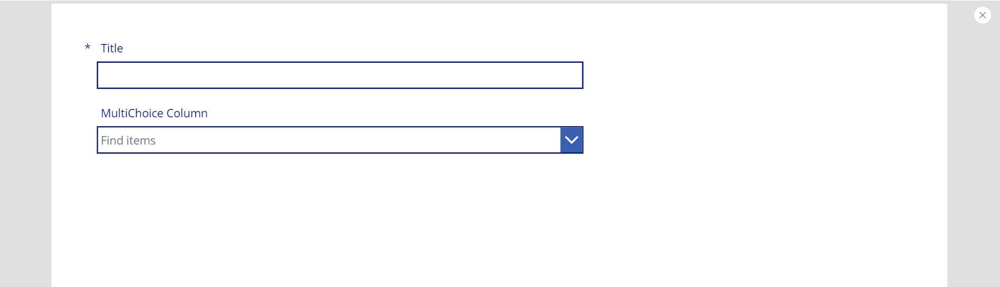

---

## ⚙️ Properties Overview

| Property Name | Type | Purpose |
|:--------------|:-----|:--------|
| `Items` | Table (Input) | List of all available SharePoint choices |
| `SelectedItems` | Table (Input) | Currently selected choices |
| `IsEditMode` | Boolean (Input) | Whether the form is in edit mode |
| `Reset` | Function (Input) | To reset the component manually |

---

## 📋 Quick Setup Summary

```powerfx
// Screen OnVisible
Set(varItems, DataCardValueXX.Items);
Set(varDemoItem, ThisItem);
Set(varSelectedItems, DataCardValueXX.SelectedItems);
Reset(ComponentName);

// Set inside Form
FormName.Item = varDemoItem

// Inside DataCardValue
DefaultSelectedItems = Filter(varSelectedItems, Value in varSelectedItems)
```

---

## 🚧 Limitations

- This component **cannot** be used directly inside Galleries or Edit Forms.
- You must use a **custom form** and manage data using `Patch()` for submissions.
- For Edit Form support, see this guide:  
  👉 [Phone Number Formatting in a Form (Matthew Devaney)](https://www.matthewdevaney.com/power-apps-phone-number-formatting-in-a-form-input-mask/)

---

## 🙏 Credits

Developed to bring back SharePoint's true **Fill-In Choice** experience into modern Power Apps solutions.

---
